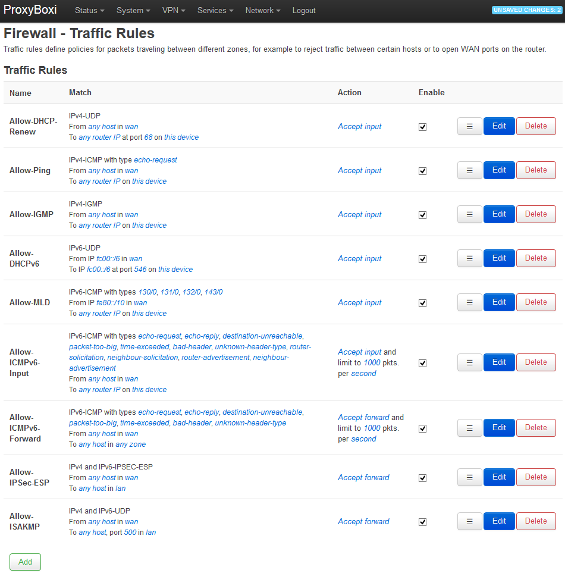
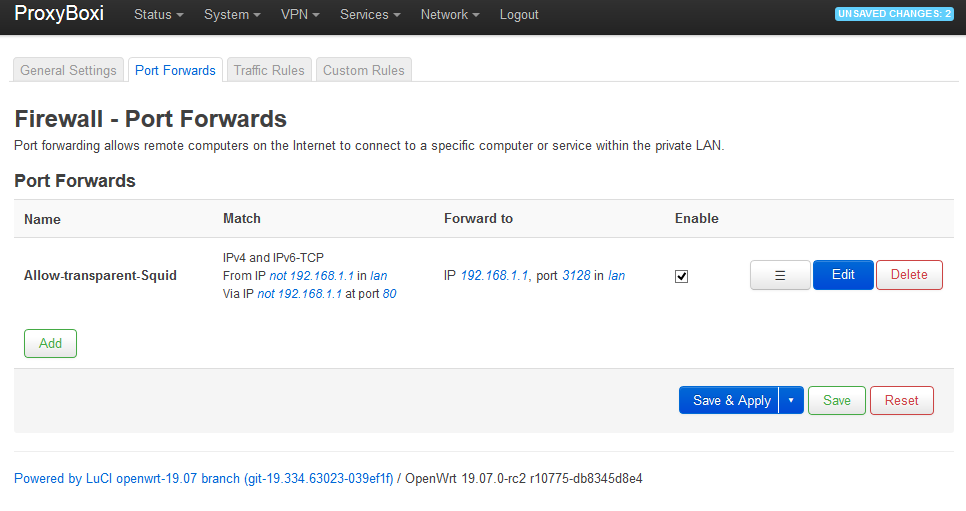
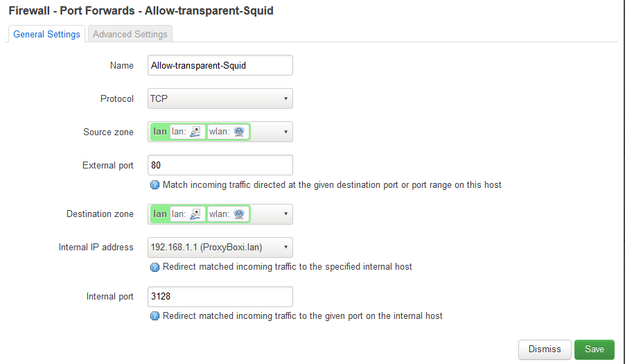
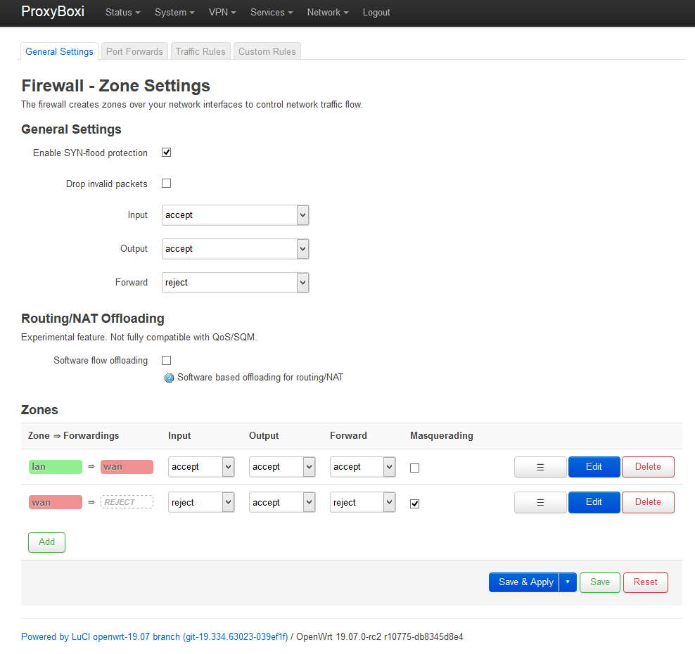
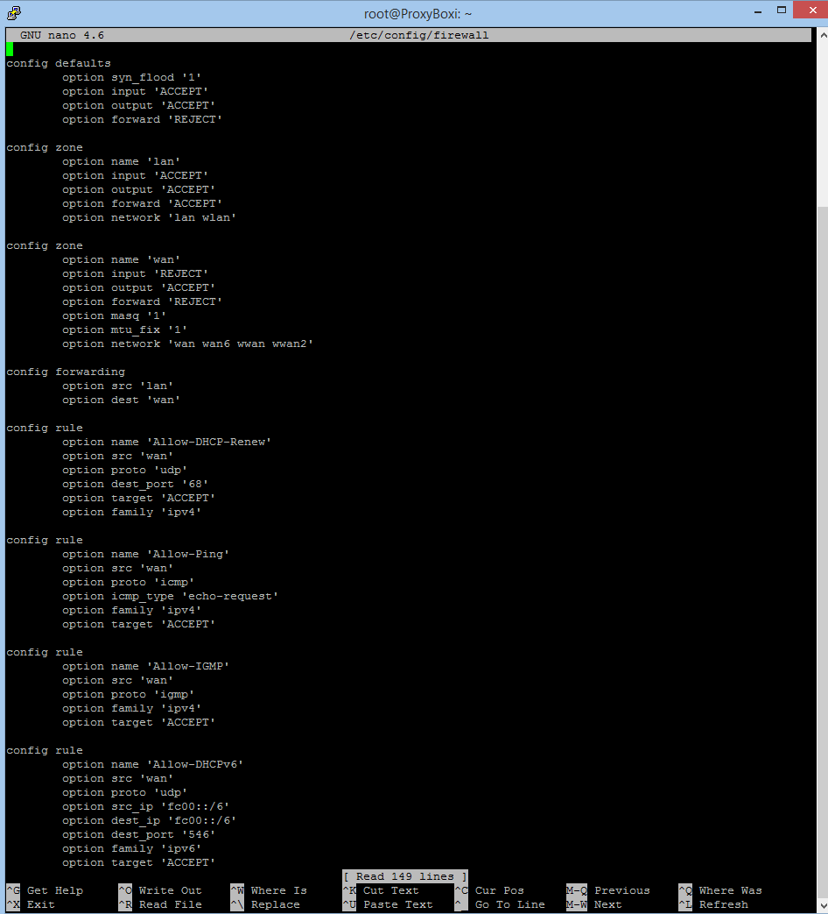

# OpenWrt #


----------


##  Tärkeää tietää aiheesta  ##

Tässä ohjeessa käytetään pohjana OpenWrt 19.07.0-rc2 -versiota, joka julkaistiin sunnuntaina 1.12.2019. Ohjeists

OpenWrt -käyttöjärjestelmän dokumnetaatio on saatavilla seuraavasta linkistä:
[OpenWrt.org dokumentaatio](https://openwrt.org/docs/start)

Edellä mainitut ohjeet ovat tällä hetkellä hyvin suntaa antavia tietyissä tapauksissa sillä **Raspberry Pi 3b +** kehitysalustan toiminnallisuus poikkeaa perinteisestä reitittimestä.

[OpenWrt](https://openwrt.org/about)- ja [LEDE](https://openwrt.org/about) -projektit yhdistyivät Tammikuussa 2018 ja sen takia aikaisemmin linkatussa ohjeistuksessa voi esiintyä molempien projektien termistöä. On kuitenkin hyvä tietää, että ohjeita päivitetään jatkuvasti lisää.


OpenWrt käyttää komentorivillä `ash shell` syntaksia.


**Sanastoa**

* OpenWrt = OPEN Wireless RouTer 
* LEDE = Linux Embedded Development Environment
* LuCI = Lua Configuration Interface

----------

## Esivalmistelut ##

Ratkaisun käyttöönottoa ennen tarvitsee suorittaa esivalmisteluita ja hankkia sopivat osat.

- Tarvitset laitteen **Raspberry Pi 3b +**, koska se sisältää oman WiFI:n
- Tarvitset myös USB-näppäimistön ja 
- Tarvitset Raspberry Pi yhteensopivan **verkkovirta-adapterin (suositus 5.1V 2.5A)** tai sopivan **akun (suositus 5V 2.4 - 3A)**. Akun saa kiinnittää parhaaksi katsomallaan tavalla, joko käyttämällä micro-USB liitäntää tai vetämällä virtajohdot suoraan GPIO-pinneille Raspberry Pi:ssä. Jälkimmäinen vaihtoehto vaatii tarkkuutta ja tietämystä, joten se on tämän projektin rajojen ulkopuolella.
- **microSD-kortti**, jossa vähintään **UHS-1**, mutta mielellään **UHS-3** nopeusluokitus.  (UHS = Ultra-High Speed suorituskykyluokka, joka korvaa jatkossa vanhemmat nopeusmerkinnät)
- Tarvitset ohjelman, jolla voit purkaa toimivan imagen boottaavaan muotoon **microSD-kortille**. Suosittelemme käytettäväksi **BelanaEtcher**iä tai **Win32 Disk Imager 1.0**
- Tarvitset Raspberry Pi:lle suunnatun OpenWRT:n, joka on ladattavissa osoitteesta: https://downloads.openwrt.org/releases/19.07.0-rc2/targets/brcm2708/bcm2710/
- Kannattaa valita tällä hetkellä tuo **rpi-3-ext4-factory.img.gz**, jonka versio on **19.07.0-rc2**. Tämä on toimivin paketti raportin työstämisen aikaan
- Kun image on purettu microSD-kortille, on yleensä ext-osoi kortilla liian pieni. Helpoiten tämän osion voi laajentaa **gparted**-nimisellä Linux ohjelmalla, mutta mikä tahansa muu osiointiohjelma ja käyttöjärjestelmä kelpaa tähän. On myös teoreettisesti mahdollista uudelleenmäärittää osointi suoraan Raspberry Pi:ssä kun järjestelmä on käytössä, muttta tuolloin prosessi on erittäin monimutkainen ja tuloksia ei voi taata.
- Ohjelmisto on nyt valmis ensimmäiseen käyttnistykseen.
- Muista liittää ennen käynnistystä Raspberry Pi:hin **USB-näppäimistö** ja yhteensopiva **WLAN-tikku**. Yhteensopivuus on hankala määrittää etukäteen ja jouduimme itsetestaamaan usean laitteen ennen sopivan löytymistä, mutta nyrkkisääntönä 5GHz tikut eivät usein toimi tai ylikuumenevat firmware ongelmien takia. Parhaat tulokset saimme WLAN-tikuilla jotka käyttävät RealTek:n **RTL8188CUS** piirisarjaa tai jotain sen variantteja. 

## Käyttöönotto ##

Kun laite käynnistetään ensimmäisen kerran, on syytä jättää ethernet johto irti, koska kaikissa OpenWRT versioissa `dhcp` tai esimääritetty staattinen IP ei toimi oikein, ellei seuraavaa kodia syötetä ensin komentoriville.

Ensin on syytä turvata laitteen käyttö asettamalla pääsalasana root tilille komennolla `passwd`, jonka jälkeen voidaan siirtyä itse verkkoyhteyden asetuksiin seuraavilla koodeilla

    uci set network.lan.proto=dhcp
    uci commit
    /etc/init.d/network restart

Selite:
- ensimmäinen komento `uci set network.lan.proto=dhcp` määrittää verkon `network` käyttämään `lan` lähiverkossa `proto=dhcp` protokollaa DHCP. Tämän korvaa laitteen oman esiasetetun verkko osoitteen `192.168.1.1`.
- `uci commit` suorittaa ja tallettaa edellä ohjelmoidut muutokset ja kuuluu OpenWRT:n perus synksitoiminnallisuuteen vastaavissa säädöissä. 

Toinen vaihtoehtoinen tapa on viimeisen restart komennon korvaava koko laitteen uudelleenkäynnistäminen.

    reboot

Edeltävä koodi on aikaisempaa esimerkkiä varmempi toteutustapa, mutta vie enemmän aikaa. Tämä aika riippuu hyvin paljon käytettävästä ohjelmistoversiosta ja käytettävstä microSD-kortista.

Tässä vaiheessa on syytä kiinnittää ethernet piuhalaitteeseen, olettaen toki, että käytössäsi on normaali reititin, joka jakaa IP-osoitteen laitteelle automaattisesti.

DHCP ja IP-osoitteen tarkistus kun ethernet on liitetty laitteeseen:

    ifconfig

Päivitetään käyttöjärjrestelmän ohjelmisto repository ja asennetaan alustavat tarvittavat paketit seuraavilla komennoilla:

    opkg update
    opkg installa luci
    opkg install nano

Selitteet:
- Opkg = paketinhallintajärjestelmä (lisätitetoja, sekä käyttöohjeet löytyvät osoitteesta https://openwrt.org/docs/guide-user/additional-software/opkg)
- `opkg update` päivittää repositoryn
- `opkg install luci` asentaa luci:n
- LuCI = Lua Configuration Interface, jokatoimii frontend ratkaisuna webselaimen kautta OenWRT:ssä
- `opkg install nano` asentaa ohjelman nimeltä nano, joka on erittäin helppokäyttöinen tekstieditori (käytetään myöhemmin asetusten luomisessa ja muokkaamisessa)


Tässä vaiheessa on mahdollista tehdä vaihtoehtoisia mutta ei vielä pakollisia asioita, kuten esimerkiksi SSL suojauksen käyttöönotto.

    kkkokpk

kfksopfkskfpsjsgisjijgo

## Perusasetukset graafisessa näkymässä ##

Firmware


# Squid Proxy #

Ottamalla käyttöön Squidin proxy:n (Squid 4.6) ProxyBoxi:ssa on loppukäyttäjän tietoturvan kannalta oleellista käyttää ACL-sääntöjä. Tämä vaihtoehto otetaan käyttöön mahdollisen verkkokäytön profiloinnin estämiseksi. Squid:n proxy toimii tässä tapauksessa cache-proxyna (transparent proxy), jolla on oma cache-kansio microSD-kortilla. 

Asennus:

Asennetaan Squid proxy komennolla:

```
opkg install squid
```
Proxy-ohjelmiston asentamisen jälkeen asennetaan vielä cache manageri ja LuCI hallinta moduuli squidille:

```
opkg install luci-app-squid squid-mod-cachemgr
```

Tämän jälkeen säädetään palomuuria CLI-pohjaisesti:

```
nano /etc/config/firewall
```

Tänne laitetaan säännös sallimaan liikenne lähtöportista 80/tcp kohdeporttiin 3128.

```
config redirect 

            option name 'Allow-transparent-Squid' 

            option enabled '1' 

            option proto 'tcp' 

            option target 'DNAT' 

            option src 'lan' 

            option src_ip '!192.168.1.1' 

            option src_dip '!192.168.1.1' 

            option src_dport '80' 

            option dest 'lan' 

            option dest_ip '192.168.1.1' 

            option dest_port '3128' 
```

Seuraavaksi pitää säätää squid.conf:ia.

```
nano /etc/squid/squid.conf
```

Tänne laitetaan seuraavat asetukset:

```
acl localnet src 10.0.0.0/8 
acl localnet src 172.16.0.0/12 
acl localnet src 192.168.0.0/16 
acl localnet src fc00::/7 
acl localnet src 192.168.1.111/16 
acl localnet src fe80::/10 

acl ssl_ports port 443 
acl safe_ports port 80 
acl safe_ports port 21 
acl safe_ports port 443 
acl safe_ports port 70 
acl safe_ports port 210 
acl safe_ports port 1025-65535 
acl safe_ports port 280 
acl safe_ports port 488 
acl safe_ports port 591 
acl safe_ports port 777 
acl connect method connect 
acl blocksites dstdomain "/etc/squid/Ads.conf" 

http_access deny !safe_ports 
http_access deny connect !ssl_ports 
http_access deny localhost manager 
http_access deny manager 
http_access deny to_localhost 
http_access allow localnet 
http_access allow localhost 
http_access deny all 
refresh_pattern ^ftp: 1440 20% 10080 
refresh_pattern ^gopher: 1440 0% 1440 
refresh_pattern -i (/cgi-bin/|\?) 0 0% 0 
refresh_pattern . 0 20% 4320 

access_log none 
cache_log /dev/null 
cache_store_log stdio:/dev/null 

logfile_rotate 0 
logfile_daemon /dev/null 

http_port 3128 intercept 

cache_dir aufs /tmp/squid/cache 600 16 512 

cache_mem 8 MB              
maximum_object_size_in_memory 100 KB 
maximum_object_size 32 MB 
```
Squid:n asetusten säätämisen jälkeen pitää tehdä komennot:

```
Squid –k reconfigure #uudelleen konfiguroi squid:n 

Squid –z #rakentaa tiedosto puun uudelleen squid:lle

squid #käynnistää squidin uudelleen
```
Seuraavaksi täytyy muuttaa /etc/sysupgrade.conf tiedostoa, jotta asetukset Squid:n cache:lle säilyvät. Seuraavat rivit on lisättävä aiemmin mainittuun tiedostoon: 

```
nano /etc/squid/squid.conf 
```

Tämän jälkeen cache proxyn asennus pitäisi olla suoritettu onnistuneesti. Vielä pitää kuitenkin tehdä tiedosto, josta Squid hakee estettävät sivustot. Tämä tiedosto luodaan komennolla: 

```
nano /etc/squid/Ads.conf  
```

Ads.conf:n laitetaan esimerkiksi seuraavat:

```
Mainos.fi 
Testisivu.net 
123.123.123.123 
```
Tämän jälkeen annetaan Ads.conf:lle vielä oikeudet:

```
chmod 755 Ads.conf
```
Tämän jälkeen käynnistetään OpenWrt uudelleen:

```
reboot
```
Nyt pitäisi olla proxy käytössä ja tämän voit kokeilla proxy:ä käytännössä laittamalla seuraavat asetuksen esimerkiksi selaimeen:

```
http proxy IP: 192.168.1.1
Portti: 3128
```

Lähde: https://openwrt.org/docs/guide-user/services/proxy/proxy.squid


# OpenVPN Client #

Tietoturvan lisäämiseksi on hyvä lisätä OpenVPN Client ratkaisu ProxyBoxiin, jolloin OpenWrt toimisi VPN-clienttina ja kaikki liikenne kulkisi salatun VPN-tunnelin lävitse. Tällöin mahdollinen hakkeri ei pääsisi tutkimaan tietoliikennettä yhtä helposti. 
HUOM!!! TÄMÄ RATKAISU EI TOIMI! OpenVPN ei toiminut nykyisellä asennusmetodilla ProxiBoxi:n kanssa ohjelmisto bugin ja kommunikaation palomuurin kanssa.

Asennetaan OpenVPN ohjelmistot:

```
opkg install luci-app-openvpn openvpn-easy-rsa openvpn-openssl
```

Nyt asetetaan palomuuri vielä sallimaan liikenne palomuuri-alueiden lävitse tunneloimalla liikenne:

```
uci rename firewall.@zone[0]="lan" 

uci rename firewall.@zone[1]="wan" 

uci rename firewall.@forwarding[0]="lan_wan" 

uci del_list firewall.wan.device="tun0" 

uci add_list firewall.wan.device="tun0" 

uci commit firewall/etc/init.d/firewall restart 
```

Tämän jälkeen asetukset /etc/openvpn/client.conf:n

```
umask u=rw,g=,o=cat << "EOF" > /etc/openvpn/client.conf  Vpn_client_konfiguraatio_asetukset EOF  
```
HUOM! muista asettaa VPN-client konfiguraatio asetukset "Vpn_client_konfiguraatio_asetukset" kohtaan.

Lopuksi piti vielä konfiguroida VPN-client komennolla:

```
sed -i -e "/^user/s/^/#/\$a user nobody/^group/s/^/#/\$a group nogroup/^dev/s/^/#/\$a dev $(uci get firewall.wan.device | sed -e "s/^.*\s//")" /etc/openvpn/client.conf 

/etc/init.d/openvpn restart 
```

Nyt pitäisi olla openvpn asennettuna openvpn-client.

Lähde: https://www.ovpn.com/en/guides/openwrt


# Palomuuri #

Palomuuri on tietoturvan kannalta yksi tärkeimmistä työkaluista, joka on OpenWrt:ssä alustavasti päällä ja sisältää vakiona toiminnan kannalta kohtalaisen turvalliset asetukset. OpenWrt:n palomuuri käyttää hallintaan firewall3:sta (fw3) ja säädökset toimivat IP-tables:n pohjalta. Palomuuria pystyy hallitsemaan /etc/config/firewall tai LuCI:sta palomuuriosiosta. LuCI:sta pystyy myös hahmottamaan hyvin palomuuri alueet, kuten LAN- ja WAN-alueet. Näitä pystyy myös säätämään samasta paikasta tai CLI-pohjaisesti paikasta /etc/config/firewall.

Jotta ProxyBoxi:lla olisi perustoiminnallisuus, pitää olla seuraavanlaiset Säädökset liikenteen sallimiselle:





Esimerkiksi Squid tarvitsi port forward säännön, joka sallii liikenteen. Kuva on otettu LuCI:n palomuurin hallinta näkymästä (Pitäisi olla asennuksen yhteydessä jo valmiiksi määriteltyinä kuvanmukaisesti.):





Seuraava kuva näyttää näkymän, kun painat "edit" painiketta. Täältä pääset muokkaamaan tarkasti port forward- sääntöä.





Seuraavassa kuvassa näkyy LuCI:n palomuurin hallinta osio, jossa on palomuuri alueet ja säätömahdollisuudet näkyvissä (nämä oli ne säädöt, mitä kannattaa käyttää):





Seuraavassa kuvassa on otos /etc/config/firewall tiedostosta. Palomuurin säätäminen on mahdollista myös täältä käsin:





Lähde: https://openwrt.org/docs/guide-user/firewall/firewall_configuration


# Johtopäätökset #


