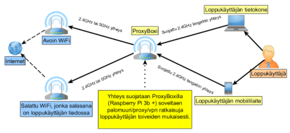
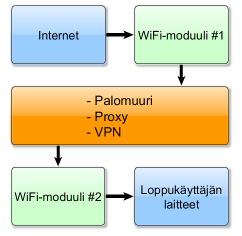

# ProxyBoxi

Tämä projekti on syntynyt osana Haaga-Helian Ammattikorkeakoulun kurssia Monialaprojekti (ICT-infrastruktuurit) PRO4TN004.

Tarkoituksemme on jatkaa potentiaalista kehitystyötä myös kyseisen kurssin ulkopuolella. Tähän repositoryyn on koottu muistiinpanoja eri projektin vaiheista ja niihin liittyvistä asennusprosesseista.

----------

## Johdanto

Projektin tarkoituksena on ollut luoda toimiva minimivaatimustason täyttävä WiFi-välityslaite ratkaisu, jossa halutaan muodostaa turvattu WiFi-yhteys käyttäjän laitteelle hyödyntäen paikallista avointa tai suojattua WiFi-verkkoa. Tässä ryhmämme luomassa ratkaisussa koko prosessi toimii välityslaitteen kautta, johon olemme soveltaneet Raspberry Pi 3b+ kehitysalustaa ja siihen liitettyjä komponentteja sekä OpenWrt-käyttöjärjestelmää. Vaatimusmäärittelymme mukaan ratkaisun tulee toimia tarvittaessa myös akkuvirralla tilanteissa, joissa verkkovirtaa ei ole saatavilla. Laitteistoratkaisumme olemme antaneet työnimen ProxyBoxi.

ProxyBoxi toimii turvallisena välityspisteenä, jota loppukäyttäjä voi itse säätää OpenWrt:hen sisältyvän LuCi-nimisen käyttöliittymän avulla. Nettiselaimen kautta tuotetun näkymän asetukset muistuttavat tyypillisen reitittimen asetukset -välilehteä. Loppukäyttäjän on näin helpompi säätää ratkaisua tietämättä itse mitään taustalla käytettävästä koodista ja toiminnoista.

## Toimintaperiaate

ProxyBoxi:n toimintaperiaate perustuu kahteen samanaikaisesti toimivaan WiFi-verkkoon. Toinen verkko on tarkoitettu luotavaksi avoimeen tai salaamattomaan verkkoon, jota voidaan pitää tietoturvalta arveluttavana. Toinen langaton verkko on tarkoitettu toimimaan turvattuna verkkona, johon loppukäyttäjä voi yhdistää laitteensa. Näin ulkoisesta verkosta tulevat uhat voidaan minimoida ja taata verkon oikea toiminnallisuus.

Laitteistoratkaisun toimintaperiaatekuvaus:

Laitetta voidaan siis käyttää myös tilanteessa, jossa mahdollinen kolmas osapuoli tai verkkohyökkääjä saattaa yrittää kerätä tietoa loppukäyttäjästä. ProxyBoxi-laitteistoratkaisun toimintaperiaatteisiin kuuluu myös palomuuri-, proxy- ja VPN-ominaisuudet, joita loppukäyttäjä voi hallita omilla laitteillaan web-selaimen välityksellä. Laitteessa on tälle oma graafinen käyttörajapinta nimeltä LuCI, joka ulkoasultaan muistuttaa perinteistä reitittimen asetussivua.

Ratkaisun ja loppukäyttäjän välinen tapahtumavirta prosessina:

